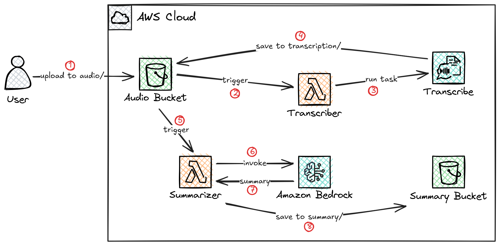

# Audio Summarizer

An automated serverless pipeline that transcribes audio files and generates AI-powered summaries using AWS services.

## Overview

This project creates an end-to-end AWS infrastructure that:
1. **Transcribes** audio files (MP3) uploaded to S3 using AWS Transcribe
2. **Summarizes** the transcriptions into key action items using Amazon Bedrock (Claude AI)
3. **Stores** the results in separate S3 buckets for easy retrieval

## Architecture


## Features

- **Fully Serverless**: No servers to manage, pay only for what you use
- **Event-Driven**: Automatically processes files as they're uploaded
- **AI-Powered**: Uses Claude 4.5 Haiku for intelligent summarization
- **Scalable**: Handles multiple concurrent audio files
- **Infrastructure as Code**: Complete Terraform configuration for reproducible deployments

## Prerequisites

- [Terraform](https://www.terraform.io/downloads.html) >= 1.0
- [AWS CLI](https://aws.amazon.com/cli/) configured with appropriate credentials
- AWS Account with access to:
  - S3
  - Lambda
  - AWS Transcribe
  - Amazon Bedrock (with Claude model access)
  - IAM

## Project Structure

```
.
├── src/
│   ├── transcriber.py      # Lambda function for audio transcription
│   └── summarizer.py       # Lambda function for AI summarization
├── lambda.tf               # Lambda function configurations
├── s3.tf                   # S3 bucket and notification setup
├── iam.tf                  # IAM policies for Lambda functions
├── variables.tf            # Terraform variables
├── outputs.tf              # Terraform outputs
├── main.tf                 # Main Terraform configuration
└── versions.tf             # Terraform version constraints
```

## Setup & Deployment

### 1. Clone the Repository

```bash
git clone <repository-url>
cd "Audio Summarizer"
```

### 2. Initialize Terraform

```bash
terraform init
```

### 3. Review the Plan

```bash
terraform plan
```

### 4. Deploy the Infrastructure

```bash
terraform apply
```

Type `yes` when prompted to confirm the deployment.

### 5. Note the Outputs

After deployment, Terraform will output:
- `audio_bucket_name`: S3 bucket for uploading audio files
- `summary_bucket_name`: S3 bucket where summaries are stored
- `transcriber_lambda_arn`: ARN of the transcriber Lambda function
- `summarizer_lambda_arn`: ARN of the summarizer Lambda function

## Usage

### Upload an Audio File

Upload an MP3 file to the audio bucket with the `/audio` prefix:

```bash
aws s3 cp your-audio-file.mp3 s3://<audio_bucket_name>/audio/your-audio-file.mp3
```

### Processing Flow

1. **Upload Trigger**: When you upload an MP3 file to `/audio` in the audio bucket, it triggers the `transcriber` Lambda
2. **Transcription**: The transcriber Lambda starts an AWS Transcribe job
3. **Transcription Complete**: AWS Transcribe saves the JSON transcript to `/transcription` in the audio bucket
4. **Summary Trigger**: The new transcript triggers the `summarizer` Lambda
5. **AI Summary**: The summarizer Lambda uses Claude AI to generate 3 key action items
6. **Result**: The summary is saved to the summary bucket

### Retrieve Results

**Get the transcription:**
```bash
aws s3 cp s3://<audio_bucket_name>/transcription/<job-name>.json ./
```

**Get the summary:**
```bash
aws s3 cp s3://<summary_bucket_name>/summary/transcription/<job-name>.json ./
```

## Configuration

### Region

Default region is `us-east-1`. To change it, modify `variables.tf` or override during deployment:

```bash
terraform apply -var="region=us-west-2"
```

### AI Model

The project uses Claude 4.5 Haiku (`us.anthropic.claude-haiku-4-5-20251001-v1:0`). To use a different model, update the `modelId` in `src/summarizer.py`.

### Transcription Language

Default language is `en-US`. To change it, modify the `LanguageCode` parameter in `src/transcriber.py`.

## IAM Permissions

The project creates two IAM policies:

### Transcriber Policy
- S3: Read/Write access to audio bucket
- Transcribe: Start transcription jobs

### Summarizer Policy
- S3: Read access to audio bucket
- S3: Write access to summary bucket
- Bedrock: Invoke Claude model

## Cost Considerations

This project uses several AWS services that incur costs:

- **S3**: Storage and data transfer
- **Lambda**: Per-invocation and duration
- **AWS Transcribe**: Per-second of audio transcribed
- **Amazon Bedrock**: Per-token for Claude model usage

Estimated cost for processing a 10-minute audio file: ~$0.10-$0.30 USD

## Cleanup

To destroy all resources and avoid ongoing charges:

```bash
terraform destroy
```

Type `yes` when prompted to confirm.

**Note**: S3 buckets are configured with `force_destroy = true`, so all objects will be deleted automatically.

## Troubleshooting

### Lambda Function Errors

Check CloudWatch Logs:
```bash
aws logs tail /aws/lambda/transcriber --follow
aws logs tail /aws/lambda/summarizer --follow
```

### Bedrock Access Issues

Ensure you have enabled Claude model access in the Bedrock console for your region.

### Transcription Not Starting

Verify:
- Audio file is in MP3 format
- File is uploaded to `/audio` prefix
- Lambda has proper IAM permissions

## License

This project is open source and available under the MIT License.

## Contributing

Contributions are welcome! Please feel free to submit a Pull Request.

## Author

Anuj M.

## Acknowledgments

- Built with [Terraform AWS Lambda Module](https://github.com/terraform-aws-modules/terraform-aws-lambda)
- Powered by AWS Transcribe and Amazon Bedrock
- AI summarization by Anthropic Claude
